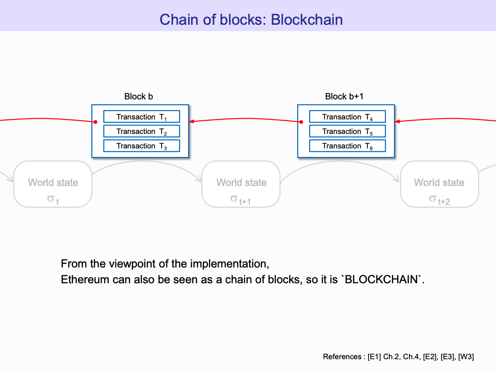
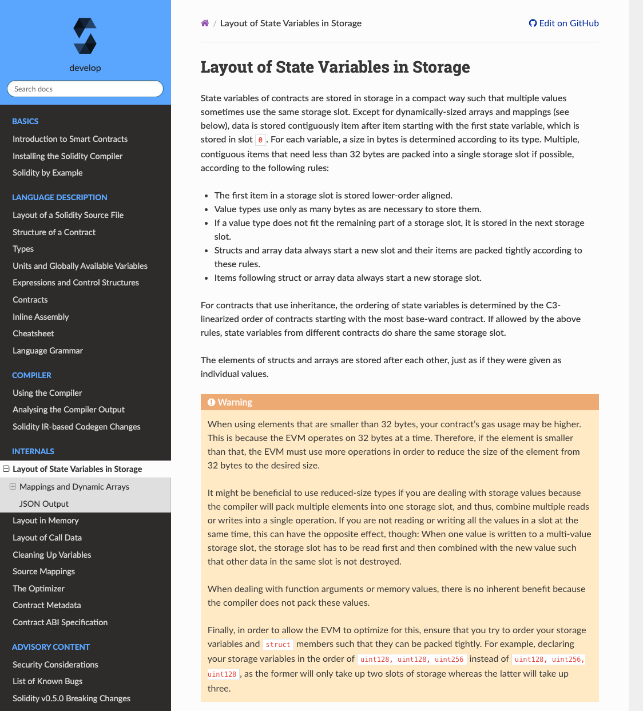

# Lecture

在[登链社区](https://learnblockchain.cn/)和 [rebase 社区](https://github.com/rebase-network)分享 SLOADS


今天和大家分享我们在 ETHBeijing Hackathon 上做的工作。

因为 EVM 存在一些限制，所以 Foundry 在本地测试的时候，有作弊码来突破这些限制。简单的说我们就是新增了一组作弊码，来获取某个智能合约的存储 Slot。

要介绍 EVM 的限制，需要先介绍 EVM 的存储布局等背景知识。
## EVM 存储布局

这个图片的来源我放后面 reference 了，它有 100 多页，讲得挺细致的，推荐。



这里是我们熟悉的区块链，一组新的交易构造成区块，然后一个区块接一个区块，就组成了区块链。

以太坊除了区块链之外，还有世界状态，World state，黄皮书里面把以太坊描述成基于交易的状态机。通过区块里面的交易，来改变以太坊的世界状态。


那么这个世界状态里面有什么, 这个世界状态是有很多 Account 对象组成


Account 的包含 nonce, balance, storage, code 这四个信息。其中对于 EOA 账号，就是用户用私钥控制的账号，就只有 nonce 和 balance 有用，然后对于 合约账号，还有 storage 和 code。其中 storage 就是用于永久存储合约里面的状态变量。


Account 里面的 storage 是这样的，key 就是 storage slot，然后 value 就是存储对应的值了，key 和 value 都是 256 bit，存储空间可以存储 $2^{256}$ 个条目。一般来讲，这个空间肯定够用的。


Solidity 里面我们可以申明很多状态变量，那么它们是怎么和这个唯一的存储空间对应上的？

```solidity
// SPDX-License-Identifier: MIT
pragma solidity ^0.8.17;

/// @title RecordMapping
contract RecordMapping {
  int length;
  mapping(address => int) data;
  mapping(int => mapping(int => int)) nestedData;

  function setData(address addr, int value) public {
      data[addr] = value;
  }

  function setNestedData(int i, int j) public {
      nestedData[i][j] = i * j;
  }
}
```

Solidity 文档里面有关于[存储布局的描述](https://docs.soliditylang.org/en/develop/internals/layout_in_storage.html):



比如


## Foundry 作弊码原理

## SLOADS 的工作

## Demo

## reference
* https://takenobu-hs.github.io/downloads/ethereum_evm_illustrated.pdf