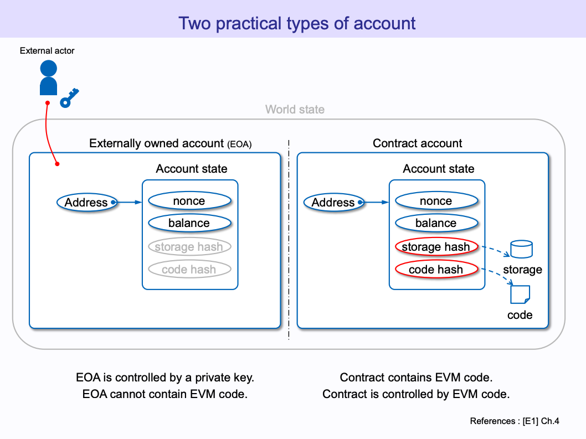

# Lecture

在[登链社区](https://learnblockchain.cn/)和 [rebase 社区](https://github.com/rebase-network)分享 SLOADS


今天和大家分享我们在 ETHBeijing Hackathon 上做的工作。

因为 EVM 存在一些限制，所以 Foundry 在本地测试的时候，有作弊码 Cheatcode 来突破这些限制。简单的说我们就是新增了一组作弊码，来获取某个智能合约的存储 Slot。

要介绍 EVM 的限制，需要先介绍 EVM 的存储布局等背景知识。
## EVM 存储布局

这个图片的来源我放后面 reference 了，它有 100 多页，讲得挺细致的，推荐。

这里是我们熟悉的区块链，一组新的交易构造成区块，然后一个区块接一个区块，就组成了区块链。


以太坊除了区块链之外，还有世界状态，World state，黄皮书里面把以太坊描述成基于交易的状态机。通过区块里面的交易，来改变以太坊的世界状态。


那么这个世界状态里面有什么, 这个世界状态是有很多 Account 对象组成


Account 的包含 nonce, balance, storage, code 这四个信息。其中对于 EOA 账号，就是用户用私钥控制的账号，就只有 nonce 和 balance 有用，然后对于合约账号，还有 storage 和 code。其中 storage 就是用于永久存储合约里面的状态变量。


Account 里面的 storage 是这样的，key 就是 storage slot，然后 value 就是存储对应的值了，key 和 value 都是 256 bit，存储空间可以存储 $2^{256}$ 个条目。一般来讲，这个空间肯定够用的，但是在早期一些智能合约里，如果有数组可以让用户直接修改数组长度，则可能导致覆盖其他变量值的问题。


Solidity 里面我们可以申明很多状态变量，那么它们是怎么和这个唯一的存储空间对应上的？

```solidity
// SPDX-License-Identifier: MIT
pragma solidity ^0.8.0;

import "@openzeppelin/contracts/token/ERC20/ERC20.sol";

contract GLDToken is ERC20 {
    struct Struct {
        address addr;
        uint256 val;
    }

    Struct[] public arr;

    constructor(uint256 initialSupply) ERC20("Gold", "GLD") {
        _mint(msg.sender, initialSupply);
    }

    function pushArr(address _addr, uint256 _val) public {
        arr.push(Struct(_addr, _val));
    }
}
```

Solidity 文档里面有关于[存储布局的描述](https://docs.soliditylang.org/en/develop/internals/layout_in_storage.html):


比如上面这个合约，里面有 _balances, _allowances, _totalSupply, _name, _symbol, arr 四个状态变量，根据描述，它们的存储占用是：

```sh
$ forge inspect ./src/Token.sol:GLDToken storage --pretty
| Name         | Type                                            | Slot | Offset | Bytes | Contract               |
| ------------ | ----------------------------------------------- | ---- | ------ | ----- | ---------------------- |
| _balances    | mapping(address => uint256)                     | 0    | 0      | 32    | src/Token.sol:GLDToken |
| _allowances  | mapping(address => mapping(address => uint256)) | 1    | 0      | 32    | src/Token.sol:GLDToken |
| _totalSupply | uint256                                         | 2    | 0      | 32    | src/Token.sol:GLDToken |
| _name        | string                                          | 3    | 0      | 32    | src/Token.sol:GLDToken |
| _symbol      | string                                          | 4    | 0      | 32    | src/Token.sol:GLDToken |
| arr          | struct GLDToken.Struct[]                        | 5    | 0      | 32    | src/Token.sol:GLDToken |

```

如果往 _balances, _allowances 里面添加元素的话，那么布局大概是怎样的呢？这个需要后面我们结合 demo 来具体展示


## Foundry 作弊码原理

Foundry 里面直接使用 Solidity 写测试，很方便，而且这也符合编程习惯，就是你用其他语言的时候，你写测试也是用和 src code 同一个语言写测试嘛。

但是标准的 solidity 功能有限，甚至无法完成基本的测试。所以我们需要扩展一些额外的功能来满足测试的需要，这是 Cheatcode 的来源。

Foundry book 里面有对 [Cheatcodes](https://book.getfoundry.sh/forge/cheatcodes) 的具体描述，就是能够赋予开发者额外的能力，比如修改状态等。

Foundry 里面的 cheatcode 形式上都是用 `vm.function()` 去调用，我们可以去看一下 forge-std, 首先它这些都是 interface，都没有实现的，然后在 Base.sol 里面，vm 指定一个合约地址，它是这样生成的：
```solidity
    address internal constant VM_ADDRESS = address(uint160(uint256(keccak256("hevm cheat code"))));
```

因此这个地址里面也没有合约代码。


Foundry 是这样做的，在执行的时候, evm 会先[检查调用的地址](https://github.com/foundry-rs/foundry/blob/master/evm/src/executor/inspector/cheatcodes/mod.rs#L537-L542)是不是我们指定的 vm 地址，如果是的，我们就不去加载里面的 bytecode，以及那个合约的 storage 等。而是直接执行 [Rust 实现的对应的功能](https://github.com/foundry-rs/foundry/blob/master/evm/src/executor/inspector/cheatcodes/env.rs#L217)。所以整的来说就是通过 EVM 底层监听并拦截对特定地址的调用，然后特殊处理。

现在有很多兼容 EVM 的链，它们经常增加一些“系统合约”，其实原理是一样的。

## SLOADS 的工作

某个合约，经过一些交易之后它的 Storage 布局是怎样的？具体的例子就是某个 token 合约，holder 有哪些人，有哪些人 approve 别人使用他们的 token，某个人 approve 哪些人使用 token？

https://github.com/foundry-rs/foundry/pull/4710/files

## Demo

```sh
 this: 0x7fa9385be102ac3eac297483dd6233d62b3e1496
alice: 0x328809bc894f92807417d2dad6b7c998c1afdac6
  bob: 0x1d96f2f6bef1202e4ce1ff6dad0c2cb002861d3e
  eva: 0xc8b7ace09810573d7a26548e28bd7cedfc561066
  ken: 0xa951ef6f785286d158c1e602874ea1a2be3b90ea
```


token layout：

| slot                                                               | slot from                                             | var                     | value        |
| ------------------------------------------------------------------ | ----------------------------------------------------- | ----------------------- | ------------ |
| 0x0                                                                |                                                       | _balances               | 0            |
| 0x1                                                                |                                                       | _allowances             | 0            |
| 0x2                                                                |                                                       | _totalSupply            | 100000 ether |
| 0x3                                                                |                                                       | _name                   |              |
| 0x4                                                                |                                                       | _symbol                 |              |
| 0x5                                                                |                                                       | arr                     | 2            |
| ...                                                                |
| 0x01f668089858624302fa32507627ea89b2bec689f7b59b4d1dcf54f7719dc4aa | keccak(abi.encode(ken, keccak(abi.encode(alice, 1)))) | _allowances[alice][ken] | 103 ether    |
| ...                                                                |
| 0x036b6384b5eca791c62761152d0c79bb0604c104a5fb6f4eb0703f3154bb3db0 | keccak(5) + 0                                         | arr[0].addr             | alice        |
| 0x036b6384b5eca791c62761152d0c79bb0604c104a5fb6f4eb0703f3154bb3db1 | keccak(5) + 1                                         | arr[0].val              | 42           |
| 0x036b6384b5eca791c62761152d0c79bb0604c104a5fb6f4eb0703f3154bb3db2 | keccak(5) + 2                                         | arr[1].addr             | bob          |
| 0x036b6384b5eca791c62761152d0c79bb0604c104a5fb6f4eb0703f3154bb3db3 | keccak(5) + 3                                         | arr[2].val              | 24           |
| ...                                                                |
| 0x27b354124b1bbdf69546e14bb3d4bd226bad9c7d34ef0db54e9755db8b0126e9 | keccak(abi.encode(ken, 0))                            | _balance[ken]           | 400 ether    |
| ...                                                                |
| 0x2d9742ab1f4328fddf7f678f47ce5ad329ba1ac735794ee342b09552c95e8b75 | keccak(abi.encode(ken, 1))                            | _allowances[ken]        | 0            |
| ...                                                                |
| 0x3c832fd744224f5a843905399d9dbeb0ff8751fdb64aeebd10eb5b7bf11ae104 | keccak(abi.encode(bob, keccak(abi.encode(ken, 1))))   | _allowances[ken][bob]   | 402  ether   |
| ...                                                                |
| 0x445f1493cc68c68f611534b29c435d24bf4534f3f2bd8b1230bcec24939cf3b3 | keccak(abi.encode(bob, 1))                            | _allowances[bob]        | 0            |
| ...                                                                |
| 0x498b0eef7321e14ea21f07950627175c02f31dc4f2d94bc4981139b83ac6b6fa | keccak(abi.encode(eva, 0))                            | _balance[eva]           | 300 ether    |
| ...                                                                |
| 0x5c9485e95c133dad34f3f387679b58dd5998ccb89d98656d0d6d655249d4a2b6 | keccak(abi.encode(eva, 1))                            | _allowances[eva]        | 0            |
| ...                                                                |
| 0x5ff10565516c110180bb9cc111cdbc2b0a68e09ff7fac17290373c3aa4a1bb03 | keccak(abi.encode(this, 0))                           | _balances[this]         | 99000 ether  |
| ...                                                                |
| 0x8568e3b930fdca0c60e7d9f493373b5f7e8922949305a442f31d2679f58e35e5 | keccak(abi.encode(alice, 1))                          | _allowances[alice]      | 0            |
| ...                                                                |
| 0x86730766aa13f179e99ceb0949c8caeced50e4f699015d7c1cb02027d8f7e2b5 | keccak(abi.encode(bob, keccak(abi.encode(alice, 1)))) | _allowances[alice][bob] | 101  ether   |
| ...                                                                |
| 0x88cfb4008c005e51bc272c10ff33ee85a9b461f6ddfeb3bbb7a17ac17edf8d76 | keccak(abi.encode(ken, keccak(abi.encode(bob, 1))))   | _allowances[bob][ken]   | 203  ether   |
| ...                                                                |
| 0x8dadbabab7d896e1d6e41f8f4b514a810d0074773f74b8ece0bf1f294acff3ad | keccak(abi.encode(bob, 0))                            | _balances[bob]          | 200 ether    |
| ...                                                                |
| 0x967572fab754b4b15c3fce29872a110c119a3f38195e678876d64751bce53154 | keccak(abi.encode(alice, keccak(abi.encode(eva, 1)))) | _allowances[eva][alice] | 301 ether    |
| ...                                                                |
| 0xa361fb435955703c5eef43182b92eeaf3a1bbc8a4e3dd100782b68fe23dbf0b4 | keccak(abi.encode(eva, keccak(abi.encode(bob, 1))))   | _allowances[bob][eva]   | 202  ether   |
| ...                                                                |
| 0xaa2bd801e255aba50e6666c7d858e9cb1f3e9abc01bbe1860f2b6de74b206824 | keccak(abi.encode(eva, keccak(abi.encode(ken, 1))))   | _allowances[ken][eva]   | 403  ether   |
| ...                                                                |
| 0xbd7bb89e2043bf318d07b1e64b0f7c18aaf3a628d06b3399da7bf6d5850834e9 | keccak(abi.encode(alice, keccak(abi.encode(ken, 1)))) | _allowances[ken][alice] | 401  ether   |
| ...                                                                |
| 0xc0731176878807a644af178b530a0e57bca9c1d894faf949b36c2360030dbbb2 | keccak(abi.encode(bob, keccak(abi.encode(eva, 1))))   | _allowances[eva][bob]   | 302  ether   |
| ...                                                                |
| 0xca7e55bbe149397a070ba460b2c1623d62c99a427bfea871ab23d273848e4d86 | keccak(abi.encode(ken, keccak(abi.encode(eva, 1))))   | _allowances[eva][bob]   | 303  ether   |
| ...                                                                |
| 0xd3751b735d9edcdf3462f9493be94138f68ee6a5bfd2c14f7e1a7b0b58f11cca | keccak(abi.encode(alice, 0))                          | _balances[alice]        | 100 ether    |
| ...                                                                |
| 0xd5343f25c7f72accee3611bec2508fc4e7515209b0f7621d92f3e4da1b34621e | keccak(abi.encode(alice, keccak(abi.encode(bob, 1)))) | _allowances[bob][alice] | 201  ether   |
| ...                                                                |
| 0xda5f41fe0ecdcba612627393d23b998cc384f258554519360bc0a1c390fe222f | keccak(abi.encode(eva, keccak(abi.encode(alice, 1)))) | _allowances[alice][eva] | 102 ether    |
| ...                                                                |
| keccak(5) + 0                                                      |                                                       |
| keccak(5) + 1                                                      |                                                       | arr[0].val              | 42           |
| keccak(5) + 2                                                      |                                                       | arr[1].addr             | uint(bob)    |
| keccak(5) + 3                                                      |                                                       | arr[1].val              | 24           |
| ...                                                                |                                                       |


## reference
* https://takenobu-hs.github.io/downloads/ethereum_evm_illustrated.pdf